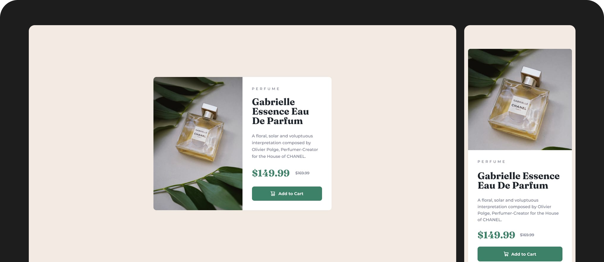

# Frontend Mentor - Product preview card component solution

This is a solution to the [Product preview card component challenge on Frontend Mentor](https://www.frontendmentor.io/challenges/product-preview-card-component-GO7UmttRfa). Frontend Mentor challenges help you improve your coding skills by building realistic projects. 

## Screenshot

### Link

- Solution URL: [Live Site](https://mateusdmc.github.io/fm-product-preview-card-component/)

## My process

### Built with

- Semantic HTML5
- Flexbox
- Mobile-first
- [Tailwind CSS](https://tailwindcss.com/) - CSS framework